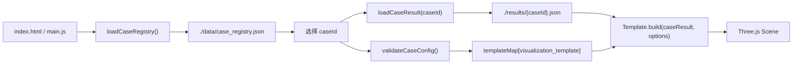
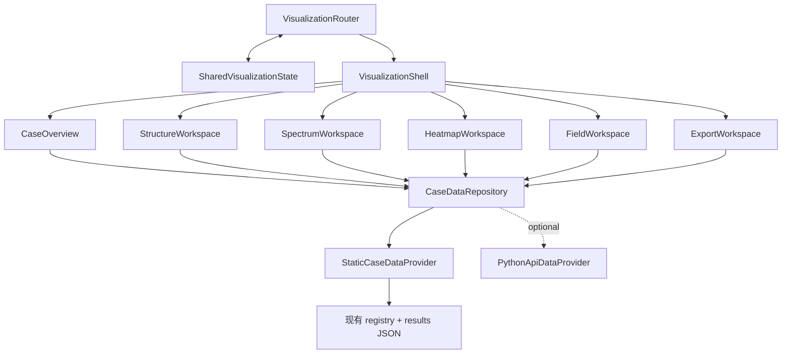

# Stage CV0：可视化工作区架构审计

## 1. 审计范围与结论

本轮只审计 `web3d/` 的案例加载、正式 JSON 绑定、模板选择、UI 面板和 Three.js 生命周期，并给出工作区化设计；不修改 Python 物理计算、正式 JSON 数值、Three.js 视觉、`migration_status`，也不实现热力图或智能窗。

结论：当前页面适合作为 `StructureWorkspace` 的可运行基线，但不适合继续在 `main.js` 内叠加光谱、热力图、场和导出功能。目标架构应拆成四层：

1. `VisualizationRouter`：只负责 URL 与工作区导航；
2. `SharedVisualizationState`：只保存跨工作区的物理选择状态；
3. `CaseDataRepository`：统一静态 JSON 与未来本地 Python API；
4. 六个 Workspace：各自拥有加载、渲染和销毁生命周期。

`StructureWorkspace` 应复用现有 Three.js 引擎、模板和资源释放逻辑，不重写视觉。`FieldWorkspace` 必须只展示带明确数据来源的定量场数据；现有动态波仍属于结构教学示意，不构成 Field 能力。

## 2. 当前页面如何加载案例、JSON 和模板

当前启动链如下：



具体行为：

- `web3d/index.html` 固定提供案例列表、`#canvas-container`、状态徽标、参数面板和证据面板五组挂载点。
- `web3d/src/data/registryLoader.js` 通过相对路径 `./data/case_registry.json` 加载注册表。开发/构建/测试前，`web3d/scripts/sync-registry.mjs` 将 `web3d/data/case_registry.json` 原样同步到 `web3d/public/data/case_registry.json`。
- `web3d/src/main.js` 初始化时读取 `window.location.search` 中的 `?case=`；无有效参数时选择注册表第一项。切换案例后并不会回写 URL。
- `web3d/src/data/caseResultLoader.js` 固定请求 `./results/{caseId}.json`。已迁移案例缺少结果文件时，`main.js` 根据现有 `migration_status` 报错；本设计不改这一状态或判断口径。
- `main.js` 内的硬编码 `templateMap` 把 `visualization_template` 映射到四个模板类：`single-interface`、`periodic-stack`、`defect-cavity`、`metal-dbr-interface`。
- 模板接收完整结果 JSON 和 `{ isExploded, polarization, selectedWavelengthNm }`。`periodic-stack` 与 `defect-cavity` 从 `wavelength_nm`、`TE/TM.R/T` 插值得到当前波长的示意波振幅；`periodic-stack` 还读取 `template_mode` 决定 DBR 或通用多层模式。
- `RendererLifecycle` 在 App 生命周期内复用一个 renderer；案例切换时由 `disposeCurrentObjects()` 销毁模板对象和资源，再重新 `build()`。现有单元测试与 E2E 已锁定单 renderer、无 context loss、动态波、偏振切换和四个工程案例连续切换行为。

四个已迁移无损工程案例的现状：

| caseId | 模板 | template_mode | 正式光谱点数 | 当前可确认数据 |
|---|---|---:|---:|---|
| `app_solar_cell_ar` | `periodic-stack` | `GENERIC_MULTILAYER_MODE` | 200 | 3 层结构、TE/TM R/T/A、metrics |
| `app_wdm_filter` | `defect-cavity` | `DEFECT_CAVITY_MODE` | 500 | 17 层结构、TE/TM R/T/A、metrics |
| `app_laser_mirror` | `periodic-stack` | `DBR_PERIODIC_MODE` | 300 | 17 层结构、TE/TM R/T/A、metrics |
| `app_phone_lens_ar` | `periodic-stack` | `GENERIC_MULTILAYER_MODE` | 200 | 3 层结构、TE/TM R/T/A、metrics |

这些 JSON 均为 schema `1.0.0`，当前没有定量 field 或二维 heatmap 数据。

## 3. 参数面板、证据面板与 Canvas 的耦合

三者没有直接互相调用，但都被 `App.loadCase()` 同步驱动，因此在编排层高度耦合：

| 关注点 | 当前数据源 | 当前更新触发 | 耦合问题 |
|---|---|---|---|
| 参数面板 | 仅 `caseConfig` | `loadCase()` | 不读取正式结果和共享选择状态；“波长”一行实际显示 `incidence_angle`，是展示绑定错误 |
| 证据面板 | 仅 `caseConfig` | `loadCase()` | 与当前工作区、数据资源和 provenance 无关，未来容易展示过度声明 |
| Canvas | `caseConfig` 选模板，`caseResult` 构建 | `loadCase()`、展开、部分偏振/波长更新 | 模板创建、资源释放、相机、动画和 UI 事件均集中在 `App` |
| 偏振 | `App.currentPolarization` | 按钮 | 不在 URL，不被面板显示为当前值；案例切换后继续沿用 |
| 波长 | `App.currentWavelengthNm` | 仅调试接口/模板方法 | 案例切换时清空；不在 URL；无正式 UI 控件 |
| 角度 | 注册表字符串；模板内部固定视觉角度 | 无 | 尚无数值共享状态；不能宣称可动态计算任意角度 |

主要架构风险：

1. `main.js` 同时承担启动、路由、数据加载、状态、DOM 绑定、Three.js 生命周期和错误处理，是单体编排点。
2. `templateMap`、DOM id 和控制按钮均与单页结构绑定，增加任何新工作区都会扩大条件分支。
3. 配置元数据与结果数据没有统一资源边界；面板无法说明某个数值来自注册表、正式 JSON、派生值还是教学示意。
4. 当前 `setWavelengthAndPolarization()` 只重建波描述，不代表重新执行 Python 物理计算。角度也未传入模板。新架构必须区分“选择已有数据切片”和“请求新计算”。
5. 当前四个工程 JSON 的 TE 与 TM 数据相同，属于现有正式输出口径；前端不得自行制造偏振差异。

## 4. 目标工作区架构



边界规则：

- Shell 只渲染全局案例选择器、工作区导航、共享选择控件、错误/加载状态和 Workspace outlet。
- Router 不加载数据、不保存 Three.js 实例，也不直接操作面板。
- Store 不保存大数组、Three.js 对象、DOM 节点、renderer、异步 Promise 或导出 Blob。
- Repository 返回规范化资源和 provenance；Workspace 不直接拼接 `./results/...` URL。
- 每个 Workspace 实现一致生命周期：`mount(context)`、`onStateChange(next, prev)`、`unmount()`；Three.js renderer 的复用策略仅封装在 `StructureWorkspace` 内。
- 参数和证据面板改成 Shell 下的上下文面板：参数控件读写 Store，证据面板读取当前资源的 provenance/capability，而不是直接依赖整个 `App`。

## 5. VisualizationRouter 设计

推荐规范路由：

```text
#/cases
#/cases/{caseId}/overview
#/cases/{caseId}/structure
#/cases/{caseId}/spectrum
#/cases/{caseId}/heatmap
#/cases/{caseId}/field
#/cases/{caseId}/export
```

共享状态放在 hash 内的 search 部分，示例：

```text
#/cases/app_wdm_filter/spectrum?wl=1550&angle=0&pol=TE&q=T&layer=none
```

Router 的职责：

1. 解析并规范化 `caseId`、`workspaceId` 和可分享状态；
2. 用 capabilities 校验工作区是否可用；不可用时跳到该案例首选工作区并展示原因；
3. 响应 `hashchange`，支持前进/后退；
4. Store 变化时使用 `history.replaceState` 更新连续选择，用 hash navigation/push 记录案例或工作区切换；
5. 处理旧入口 `?case={id}`：首次启动转换为 `#/cases/{id}/structure`，之后使用规范 hash；
6. 对未知案例、未知工作区和非法参数产生可测试的 route error，不静默加载错误数据。

不要让 Router 直接实例化模板。推荐 `workspaceRegistry` 将工作区 id 映射为懒加载模块；Three.js 模板映射继续由 `StructureWorkspace` 内部的 `StructureTemplateRegistry` 管理。

## 6. 桌面 App：选择 hash route

建议采用 hash route，query route 只作旧入口兼容。

理由：

- Vite 当前 `base: "./"`，目标是可离线分发的相对资源；hash 不参与服务器或 `file://` 路径解析，刷新和深链不要求后端 rewrite。
- 桌面 WebView、静态文件服务器和未来本地 Python HTTP 服务都能使用同一套路由，不需要为 `/cases/...` 配置 fallback。
- 路由路径与状态都可放在 `location.hash` 中，URL 可复制；旧 `?case=` 仍可读，现有 Playwright 链接不会立即失效。
- 纯 query route（如 `?case=...&view=...`）也能工作，但层级语义弱，容易把导航参数和物理选择参数混在一起，并且当前代码只在启动时读取 query、没有浏览历史同步。

约束：不要使用依赖服务端 rewrite 的 history path route。若未来桌面 App 始终由本地 HTTP server 托管，也仍可保留 hash，避免制造两种离线行为。

## 7. 六个 Workspace 的职责与渲染技术

| Workspace | 责任 | 推荐渲染 | 不应承担 |
|---|---|---|---|
| `CaseOverview` | 案例摘要、能力、指标、数据状态与入口 | HTML/CSS；小型摘要图可复用 SVG | 创建 Three.js renderer；推断缺失物理数据 |
| `StructureWorkspace` | 膜层结构、动态波、偏振示意、展开/视角 | 保留 Three.js/WebGL | 定量二维场或热力图 |
| `SpectrumWorkspace` | R/T/A 光谱、游标、当前波长选择、TE/TM 切换 | SVG（坐标轴、曲线、标记）+ HTML tooltip；200–500 点无需 WebGL | 重新计算不存在的角度或偏振数据 |
| `HeatmapWorkspace` | 波长×角度/参数二维标量矩阵 | Canvas 2D `ImageData`/离屏 Canvas；SVG 覆盖坐标轴、选择线和标注；超大矩阵再评估 WebGL | 用插值伪造正式网格 |
| `FieldWorkspace` | 有来源的一维/二维场剖面、层边界、归一化口径 | 一维曲线用 SVG；规则二维场用 Canvas 2D，层边界用 SVG overlay | 把 Three.js 教学波当作定量场 |
| `ExportWorkspace` | 枚举可导出资源、格式、provenance、hash | HTML 表单/表格；导出服务生成 JSON/CSV/SVG/PNG | 修改正式结果或触发未授权重算 |

渲染器必须通过 Workspace 生命周期隔离。切到光谱或概览时，`StructureWorkspace` 应停止动画并释放/挂起资源；是否保留单 renderer 由结构工作区内部决定，不能让其他工作区引用 scene 对象。

## 8. available_views 与四案例能力

注册表中的 `available_views` 只声明入口，不替代 capabilities 资源的详细说明。值使用稳定 id：

```json
"available_views": ["overview", "structure", "spectrum", "export"]
```

基于当前正式数据，四个无损工程案例均应先声明上述四项：

| caseId | overview | structure | spectrum | heatmap | field | export |
|---|---:|---:|---:|---:|---:|---:|
| `app_solar_cell_ar` | 是 | 是 | 是 | 否 | 否 | 是 |
| `app_wdm_filter` | 是 | 是 | 是 | 否 | 否 | 是 |
| `app_laser_mirror` | 是 | 是 | 是 | 否 | 否 | 是 |
| `app_phone_lens_ar` | 是 | 是 | 是 | 否 | 否 | 是 |

`app_wdm_filter` 的腔内驻波是 `STANDING_WAVE_ILLUSTRATION`，不构成 `field` 可用性。未来只有 `/field` 资源通过 schema 校验且 capability 标记为 `available` 时，Router 才展示 FieldWorkspace。

建议详细能力项包含 `status`、`reason_code`、`resource_href`、`quantities`、`polarizations`、`angle_support` 和 `provenance`。缺失能力要显式为 `unavailable`，不能用空数组暗示加载失败。

## 9. 跨工作区状态传递

`SharedVisualizationState` 是唯一写入口。光谱游标选择 1550 nm 后，Store 更新 `wavelengthNm`；切换到结构工作区时，结构模板订阅状态并更新动态波。热力图点选坐标时，同时更新 `wavelengthNm` 和 `angleDeg`；FieldWorkspace 和 SpectrumWorkspace 读取相同快照。

更新规则：

1. 切工作区：保留六个共享字段；
2. 切案例：先加载 capabilities，再对旧值做 reconcile；合法值保留，不合法值回退到案例默认值；
3. 用户拖动游标：Store 即时更新，URL 用 replace，避免产生大量历史记录；
4. 用户提交案例/工作区切换：URL 用 push/hash navigation；
5. 数据请求采用状态快照和 request token/AbortController，忽略过期响应；
6. `angleDeg` 只能落到资源已提供的角度或明确允许插值的网格，不能触发前端物理外推。

## 10. 向后兼容策略

四个现有案例必须在工作区化后保持：

- `?case=app_*` 仍能进入对应案例的 StructureWorkspace；
- 继续读取原 `web3d/public/results/app_*.json`，数值、hash 和 schema 不改；
- 原 `visualization_template` 和 `template_mode` 映射不改；
- Three.js mesh、颜色、相机、动态波算法、选中波长 R/T 振幅绑定和 TE/TM 几何不改；
- renderer 复用、场景销毁、无 context loss 和连续案例切换测试继续通过；
- `window.__WEB3D_DEBUG__` 在迁移窗口内保留兼容 facade，内部可转发到 Router/Store/StructureWorkspace；
- `migration_status` 原样读取，不由 capabilities 推导或回写。

兼容适配器应把结果 schema `1.0.0` 投影为新的 structure/spectrum/export 资源，不反向修改正式 JSON。若新端点缺失，离线 provider 回退到该适配器；若正式 JSON 本身缺失，则保持当前错误语义。

## 11. 审计发现的优先级

| 优先级 | 发现 | 设计处置 |
|---|---|---|
| P0 | 动态教学波与定量场容易混淆 | capabilities 和 field contract 强制 provenance/status；当前四案例不开放 field |
| P0 | Router/Store/数据/Three.js 生命周期集中在 `main.js` | 先建立 Shell、Router、Store、Repository，再迁移 UI |
| P1 | URL 只读取一次且不反映工作区/状态 | 采用规范 hash，保留 `?case=` 兼容桥 |
| P1 | 角度当前不是可交互数值数据 | Store 支持字段，但 capability 决定是否可选；不前端外推 |
| P1 | 参数面板“波长”绑定到 `incidence_angle` | 工作区化时由 typed state/resource selector 替代字符串拼接 |
| P2 | templateMap 硬编码在 App | 下沉为 StructureTemplateRegistry，不改变模板实现 |

本报告仅完成架构审计与设计；实施顺序见 `stage_cv0_migration_plan.md`，数据定义见 `stage_cv0_data_contract.md`。
